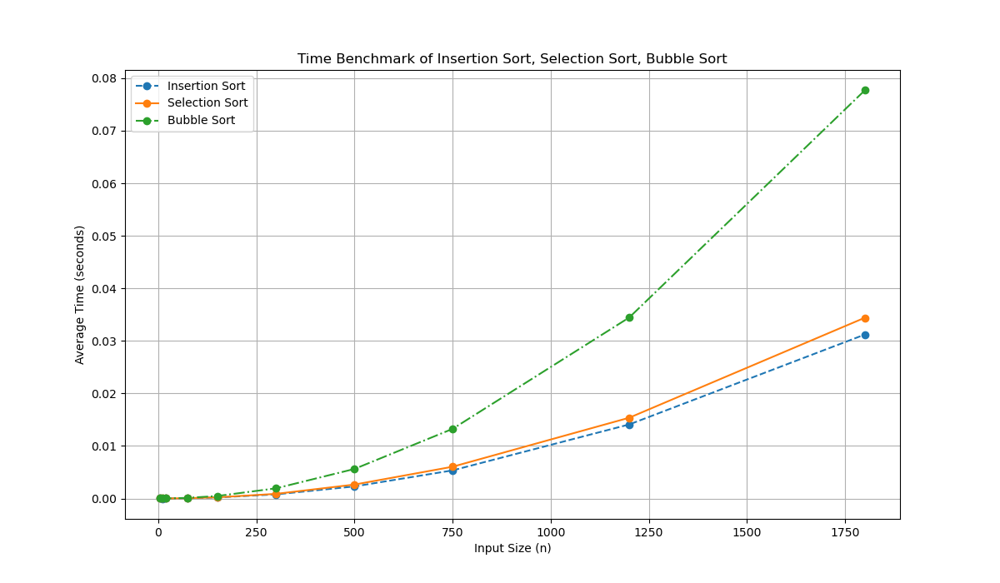

# DAA -> Sorting Algorithms Benchmarking

This repository provides an in-depth look into three classic sorting algorithms: **Selection Sort**, **Insertion Sort**, and **Bubble Sort**. It includes the source code for these algorithms, along with scripts to benchmark their performance across a range of input sizes. The goal is to offer insights into the runtime behavior of these algorithms, from small datasets to more computationally intensive scenarios.

## GitHub Repo

The complete source code and benchmark scripts can be found in my [GitHub repository](https://github.com/EthanDebnath/daa-sortingalgos-new).

## 1. Correctness of Selection Sort

### Overview

Selection Sort is a straightforward algorithm that sorts an array by iteratively finding the smallest element from the unsorted portion and swapping it with the first unsorted element. This process continues until the entire array is sorted.

### Proof of Correctness Using Loop Invariant

We can prove that Selection Sort is correct by demonstrating a loop invariant that holds throughout its execution.

**Loop Invariant**: At the beginning of each iteration of the outer loop (indexed by `i`), the subarray `array[0..i-1]` consists of the `i` smallest elements in sorted order, while the subarray `array[i..n-1]` contains the remaining unsorted elements.

#### Inductive Proof

1. **Initialization**: Before the first iteration (`i = 0`), the subarray `array[0..i-1]` is empty, which trivially satisfies the loop invariant.

2. **Maintenance**: Assuming that the loop invariant holds before the `i`-th iteration, the algorithm finds the smallest element in the unsorted subarray `array[i..n-1]` and swaps it with `array[i]`. This extends the sorted subarray `array[0..i]` by one element, maintaining the invariant.

3. **Termination**: The loop terminates when `i = n-1`. At this point, the loop invariant guarantees that `array[0..n-2]` is sorted, and the final element `array[n-1]` is the largest, thus ensuring that the entire array is sorted.

So By induction the algorithm is shown to be correct for all input arrays.

## 2. Benchmarking the Sorting Algorithms

### Benchmark Setup

The performance of Insertion Sort, Selection Sort, and Bubble Sort was measured using different input sizes, ranging from small arrays (5, 10, 20 elements) to large arrays that significantly strain system resources. 

### System Configuration

- **Device**: MacBook Pro 14-inch
- **Processor**: Apple M3 Pro Chip (12-core CPU)
- **RAM**: 18 GB
- **Operating System**: macOS (latest version)
- **Python Version**: 3.11
- **Virtual Environment**: (`base`)
- **Dependencies**: `matplotlib`

### Results and Analysis



The plot above illustrates the runtime (in seconds) against input size (n). All three algorithms demonstrate quadratic time complexity (O(n^2)) with runtime increasing significantly as our input size grows.

### Conclusion statement

The benchmarks align with theoretical expectations, confirming that these algorithms perform similarly for small inputs but struggle with larger datasets due to their O(n^2) complexity.

## 3. Environment

To replicate the benchmarks or run your own tests, set up your environment as follows:

### Step 1: Install Python

Ensure you have Python 3.11 or later installed. You can download it from the [official Python website](https://www.python.org/downloads/).

### Step 2: Install Required Packages

Open your terminal and run the following commands to install the necessary packages:

```sh
pip install matplotlib
